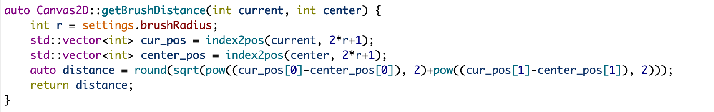
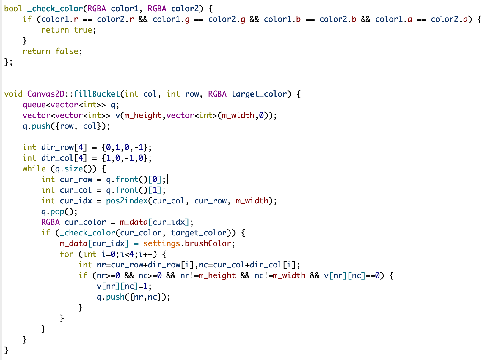
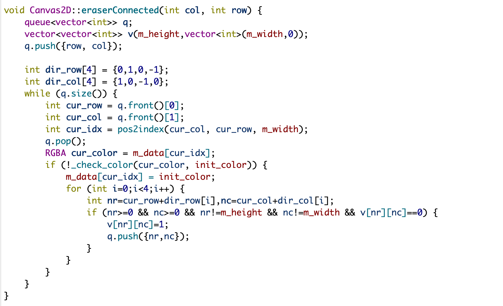

# Projects 1 & 2: Brush & Filter

All project handouts can be found [here](https://browncsci1230.github.io/projects).

**Content**

- Brush
  - introduction
  - Principle Data Structure
  - Principle Function Implementation
    - Basic Part
    - Extra Credit Part
    - My Fun Exploration Part :)

- Filter
  - Introduction
  - Basic Implementation
  - Extra Credit Implementation

# Part 1: Brush

## Introduction

Computer graphics often deals with digital images, which are two-dimensional arrays of color data (the pixels on the screen). In this project, a painting application that features multiple types of brushes that can be used to paint on a 2D canvas, similar to applications such as MS Paint and Photoshop.

## Principle Data Structure

### Color

a struct contains variables including red color, green color, blue color and alpha represented in unsigned 8 bit integer.

### Canvas

given canvas size of 1D vector, the element type of the vector is RGBA color struct

### Brush

a 1D vector mask with element be float with the size be brush size

### Prev Color for Smudge

given brush size of 1D vector, the element type of the vector is RGBA color struct

### Init Color (my fun exploration for eraser)

a struct of color contains the init canvas color same as when initialize/clear canvas

### Previous Canvas (my fun exploration for Undo Button)

double-ended queue (deque) structure with element be vector of color (canvas vector) with manually defined max_depth meaning the number of previous canvas we memorize.

the deque structure is chosen because we follow a "LRU" base to evict the oldest restored canvas if the current prev_canvas_queue size exceeds the max_depth before we push the new canvas into the queue.

## Principle Function Implementation

### Basic Part

- Update Brush

  - the writer keeps the variables including prev_brush_radius, prev_brush_type, and prev_density (for spray)

  - the brush only will be updated when current value for these variables are not same to save the time complexity

    

- Distance Check: the rule author followed here is first use Euclidean Rule calculate two point distance, after rounding the distance, if the distance is smaller than or equal to brush radius, then inlcude that point (mark with certain value in the mask)

  

- Constant Brush: if the distance is <= brush radius, fill the vector index with 1.0.

  

- Linear Brush: the equation for the linear brush is $$1-\frac{distance}{r}$$, if the distance is <= brush radius, fill the vector index with result calculated from the linear equation.

- Quadratic Brush: after calculation, $$A = \frac{1}{r^2}, B = -\frac{2}{r}, C = 1$$, so the equation for the quadratic brush is $$(\frac{1.0}{r^2})\times distance^2-\frac{2.0}{r}\times distance+1$$, if the distance is <= brush radius, fill the vector index with result calculated from the quadratic equation.

- Smudge Brush: smudge is actually similar to other brushes, the critical difference is it does not use the brush color, instead it uses the previous color we store in the vector. The process is when mouse down,  write the previous color vector according to the current brush parameters; then mouse drag, blend the previous color and current canvas color, update the previous color vector to current blended color. For the brush mask, the writer choose the quadratic brush since it is the most "soft" one, which is good for the blend effect.

### Extra Credit Part

- Fill Bucket

  - the basic idea is when mouse down and settings is fill bucket, we obtain the start color. Then we starting from the start color, iterating the canvas with DFS or BFS. The iteration keeps going when the current color is **same as the start color** and **the current position is not being visited**. It stops when encountering visited position or cross canvas boundary or current color is not the same as the start color

  - the writer chooses BFS here for two reasons: (1) better for later feature, if we want to realize tolerance for the fill bucket later, BFS is intuitively more reasonabke. (2) the implementation of BFS is queue maintained by the developer, thus will not encounter the overflow problem compared to the recursion version of DFS (of course we can also manually maintain a stack for DFS to avoid exceed max recuision problem)

    

- Spray

  - the writer uses random function to generate random number and then remainder by 100, which makes the range of the result be a random number between 0 to 100. 

  - then since density is also in the range of 0 to 100, we can see density (with certain proportion) as a threshold.

    

  - then when using the for loop to go through the brush mask (being set to 1 if in distance), we apply the random function above to see if it is a hit (over threshold), if it is a hit, we do not show the pixel by overriding the mask intensity to 0 (you can also implement the reverse version)

    

### My Fun Exploration Part :)

- **the GUI of this part is at the bottom, notice the color picker is not visible here because there still have some issue**

- Eraser

  - this one is trivial, we just need to record the "paper color", the color we use in the background

  - then when chosing eraser option, we just rewrite the part to the paper color

  - the brush type can be constant ("hard" eraser), can also to linear ("soft" eraser)

    

- Eraser Connected

  - similar to the app notability eraser continuous

  - when click, erase all of the connected "strokes", personally find this one is efficient for painting and fun hahaha

  - algorithm is simple and straight forward: BFS, DFS or Union Find

  - here the writer chose the BFS one with the similar reason to the fill bucket

    

    

- Undo One Stroke

  - sometimes we want to undo our canvas, so we need to store the previous canvas status. Okay...so what  would be a proper frequency to store it? naturally, we can store every stroke.

  - now the question is how to detect one stroke, simple, it is just when the mouse is up. One stroke contains mouse down (start) -> mouse drag (continue) -> mouse down (end).

  - cool, now the problem is trade-off between experience and efficiency: do we want to store every stroke from the beginning? it will provide user more accessibility but it has large space complexity. So here, the writer chose to make the max depth be 5, that is, when the queue length is larger than max depth, we pop out the oldest one (popright) in the deque, and push the new one (pushleft)

    

  - so the whole process is when mouse up, push the current canvas into deque, when undo buttom is clicked, pop the most recent canvas data (popleft)

    

- Color Picker

  - what the writer wants to implement here, when we mix some color, and we want to obtain the RGB color of the current color

  - the algorithm is naive, it is just get the current color when clicking mouse to pick (mouse down), and write it to brush color

  - the tricky part is how to reversely connect the GUI spinbox and settings.brush_color. Currently what we have for GUI is connect the spinbox for colors with the settings.brush_color by using signal and slot 

  - After talking to the TA, the writer understands that the proper should be modifing the QSpinBox, however, that is out of the scope of the code for this project (credit to Jianxin Gu)

  - the writer also tried to define slots under mainwindow class, but failed

    

    

    

# Part 2: Filter

## Introduction

In this part, a few common image processing algorithms using **convolution** to create filters. 

## Basic Implementation

### Blur

Since 2D Gaussian Filter can be separated into two 1D kernel, therefore the writer implemented two-pass 1D blur. 

The process is as the following:

- Create blur filter using the current pixel offset (to the center) as $x$, blur radius divided by 3 as $\sigma$ in Gaussian function to calculate the corresponding Gaussian value in the filter.

  

- apply the 1D filter two pass to the image, note to keep a variable to record filter value weight sum, such that we can apply normalization.

### Edge Detection

- we have already known the 2D edge filter, and how that can be divided into two 1D filter. Thus we can see the edge detection filter process to be four pass of 1D filter 

- also we might want to set a flag for our convolution function, to denote it is edge detection, such that we can deal with the possibility that the pixel value might > 255 or < 0: when exceed 255, we need to set it to 255; when smaller than zero, we want to take the absolute value.
- also notice we don't need to normalize when it is a edge filter.

### Scaling

we also make the scaling process a two-pass process to improve the efficiency.

- Scale by X axis
- Scale by Y axis

these two scale pass are similar, the basic idea is for every point in the output image, we calculate the left (top) boundary and right (down) boundary for sampling. Then, for each point in the range, we use triangle to calculate the sample weight and accumulate them together. Finally, when we obtain the accumulated value for three channels, we normalize them by the accumulated weight sum.

- One thing to notice here is for x and y direction, we have different boundary (one for width and one for height)

## Extra Credit Implementation

### Medium

- the idea is straight forward, for each color channel and given filter size, we find the medium value for each convolution
- okay, how should we implement the find medium value process for each convolution? If we have a array with size $k$, what we want is the $(k-1)/2$ - th largest element (the medium). We can use ugly brute force way to get the array and sort to get the element which gives us $klogk$, or we can use heap or quick select elegantly.
- The writer choose the heap method

### Bilateral Smoothing

this one is auctually similar to Gaussian smooth

- Iterate every point of the image, and apply bilateral
- each time when apply bilateral
  - iterate the filter size
  - calculate two Gaussian weight
    - space gaussian: $x$ input is the distance of the current pixel position and center pixel position
    - range gaussian: $x$ input is the value difference between center pixel and current pixel
  - accumulate the sum for three channels
  - accumulate the sum of the weight: space gaussian weight $\times$ range gaussian weight
  - normalize three channels with each accumulate weight sum

